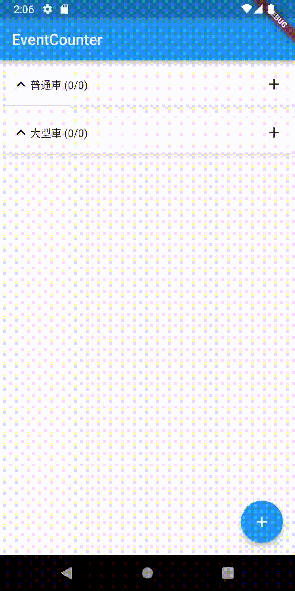
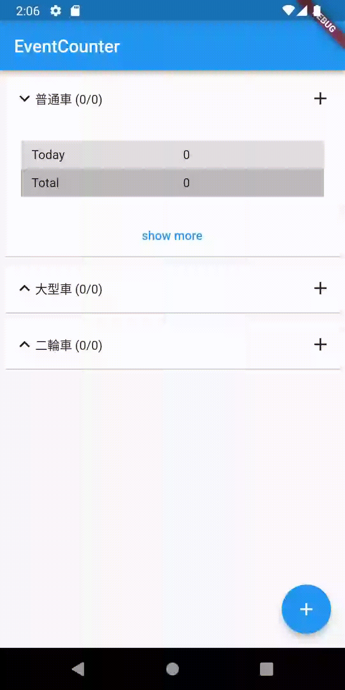
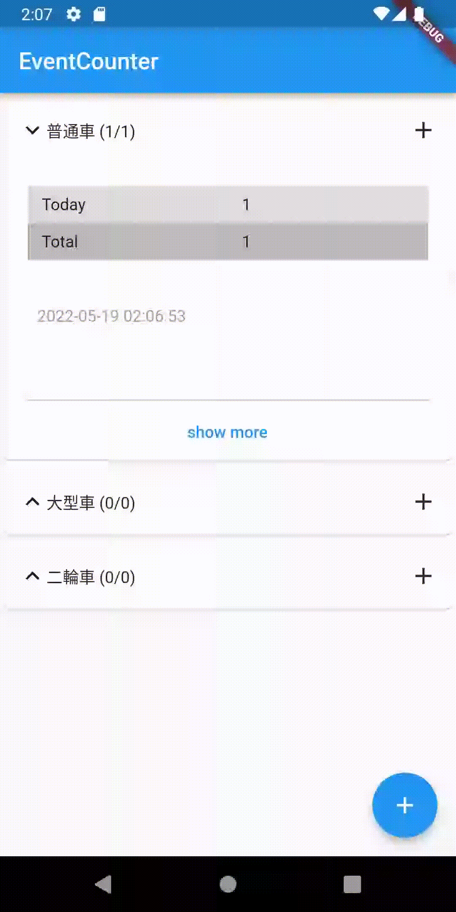
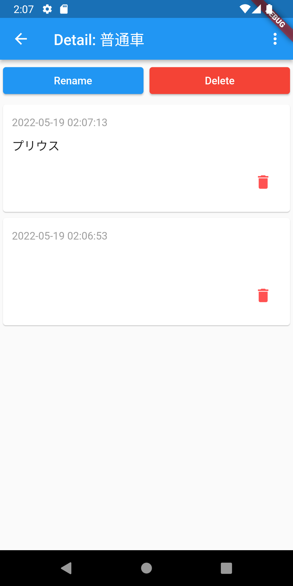

# eventcounter

A new Flutter project.

## Getting Started

This project is a starting point for a Flutter application.

A few resources to get you started if this is your first Flutter project:

- [Lab: Write your first Flutter app](https://flutter.dev/docs/get-started/codelab)
- [Cookbook: Useful Flutter samples](https://flutter.dev/docs/cookbook)

For help getting started with Flutter, view our
[online documentation](https://flutter.dev/docs), which offers tutorials,
samples, guidance on mobile development, and a full API reference.

## Screenshots

### Create group
Tap + button to create a group.

### Create event
Tap right + button to create an event.

Note: Today is the number of events created today. Total is the number of total events since a group created.

### Create event with summary
Long tap right + button to create an event with a summary.

Note: Summaries are editable in main page or detail page.

### Detail page
Tap "show more" to open group detail page.

